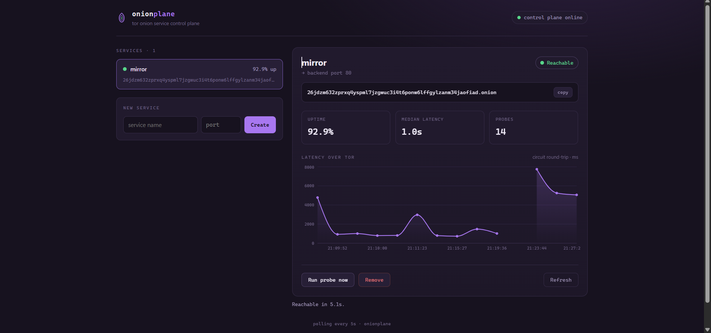
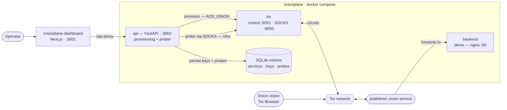

# OnionPlane


**A self-hosted control plane for Tor onion services.** Put any backend behind a
`.onion` address, keep that address stable across restarts, and monitor whether
it's actually reachable — and how slow it is — over Tor. One `docker compose up`.

OnionPlane is a tool you run for **your own** services (mirroring a site, a
SecureDrop-style intake, a privacy-preserving app). It is intentionally **not** a
service that hosts other people's content — each operator runs their own stack,
which keeps the abuse and liability surface where it belongs.



## Why this exists

Standing up a single hidden service is a solved problem — there are bash scripts,
Docker images, and even a Kubernetes operator. The gap is a **clean, modern
control plane** that sits between the crude one-off script and the heavy operator,
and makes the two things nobody makes easy:

- **`.onion`-aware monitoring.** You can't `ping` a `.onion`. Checking that one is
  up means opening a Tor circuit and doing a real request through it. OnionPlane
  runs that probe on a schedule and records reachability + latency over time.
- **Key management.** The private key *is* the address — lose it and the address
  is gone forever. OnionPlane persists the key and re-registers the service on
  restart, so the address is stable by default.

## Architecture



Three containers on an internal Docker network. The **api** is the brain: it talks
to **tor**'s control port to provision an onion service (`ADD_ONION`), which
forwards the `.onion` to a **backend**. A background prober reaches each `.onion`
through tor's SOCKS proxy (with remote DNS) and records the result to a **SQLite
volume**, alongside the private keys. The [dashboard](#dashboard) reads the API and
draws it.

## Quick start

Requires Docker with the Compose v2 plugin.

```bash
echo "TOR_CONTROL_PASSWORD=change-me" > .env
docker compose up -d --build
docker compose ps          # wait for `tor` to be healthy, `api` up
```

The API is published on `http://localhost:8001`. The bundled `demo` container
(nginx) is a stand-in backend to expose.

## Using it

```bash
# Create an onion service in front of a backend port (the demo: nginx on 80)
curl -s -X POST http://localhost:8001/services \
  -H 'content-type: application/json' \
  -d '{"name":"demo","local_port":80}'
# -> {"id":1,"onion_address":"xxxx…onion", ...}

# List services with rolling health
curl -s http://localhost:8001/services

# One service, with recent probe history
curl -s http://localhost:8001/services/1

# Probe right now (otherwise the prober runs every PROBE_INTERVAL_SECONDS)
curl -s -X POST http://localhost:8001/services/1/probe

# Tear it down
curl -s -X DELETE http://localhost:8001/services/1
```

Open the `.onion` in Tor Browser to reach the backend from outside. The first load
takes ~30–60s while the circuit builds.

## API

| Method | Path                      | Description                                   |
| ------ | ------------------------- | --------------------------------------------- |
| POST   | `/services`               | Provision a new onion service (`name`, `local_port`) |
| GET    | `/services`               | List services with health summaries           |
| GET    | `/services/{id}`          | One service with recent probe history          |
| POST   | `/services/{id}/probe`    | Run a probe immediately                        |
| DELETE | `/services/{id}`          | Remove a service                               |
| GET    | `/healthz`                | Liveness check                                 |

Interactive docs at `http://localhost:8001/docs`.

## Configuration

All via environment variables (see `docker-compose.yml` / `onionplane/config.py`):

| Variable                  | Default                     | Purpose                                      |
| ------------------------- | --------------------------- | -------------------------------------------- |
| `TOR_CONTROL_HOST`        | `127.0.0.1`                 | Tor control host (the `tor` service in Docker) |
| `TOR_CONTROL_PORT`        | `9051`                      | Tor control port                             |
| `TOR_CONTROL_PASSWORD`    | —                           | Control-port password (drives both containers) |
| `TOR_SOCKS_PROXY`         | `socks5://127.0.0.1:9050`   | SOCKS proxy the prober uses                   |
| `ONION_VIRTUAL_PORT`      | `80`                        | Port exposed on the `.onion`                  |
| `DEFAULT_TARGET_HOST`     | `127.0.0.1`                 | Backend host onion traffic forwards to        |
| `ONIONPLANE_DB`           | `onionplane.db`             | SQLite path (a volume in Docker)              |
| `PROBE_INTERVAL_SECONDS`  | `120`                       | Background probe cadence                       |
| `PROBE_TIMEOUT_SECONDS`   | `60`                        | Per-probe timeout                             |

## How it works

- **Provisioning + key persistence.** Services are created as ephemeral onion
  services via [stem](https://stem.torproject.org/); tor discards ephemeral keys
  on restart, so OnionPlane stores the ED25519 key in SQLite and re-registers
  every service on startup — the address survives restarts.
- **Monitoring.** The prober routes an HTTP request through tor's SOCKS proxy with
  `rdns=True` (remote DNS) — the only correct way to resolve and reach a `.onion` —
  and records success, HTTP status, and round-trip latency.
- **Container wiring.** The API resolves the `tor` service name to an IP (stem
  wants an IP, not a hostname) and authenticates to the control port by password,
  so no cookie files need to be shared across containers.

## Dashboard

The companion [**onionplane-dashboard**](https://github.com/Artkill24/onionplane-dashboard) (Next.js) is the
visual front end: service list, per-service latency chart, and create / probe /
remove — talking to this API through a same-origin proxy.

## Roadmap

- [ ] **Authentication** — the API is currently unauthenticated; add an API key or
  put it behind a VPN before exposing it publicly. **Required for any public deploy.**
- [ ] **Per-service target host/port** — today all services share one backend host
  (`DEFAULT_TARGET_HOST`); a DB column removes that limit.
- [ ] **Onion-Location + clearnet mirroring** (EOTK-style) — mirror an existing
  HTTPS site to `.onion`, with Host-header rewriting and TLS to the origin.
- [ ] **Vanity addresses** (`mkp224o`) and **OnionBalance** for HA.
- [ ] **Multi-tenancy** — separate accounts and data, for a hosted model.

## A note on staying legitimate

OnionPlane exposes your own services. It deliberately does not try to be an
anonymous host-anything service. Keep it that way, and check your provider's terms
before running it on a VPS (an onion service is not a relay or exit node and is low
risk, but terms vary).

## License

MIT — see `LICENSE`.
